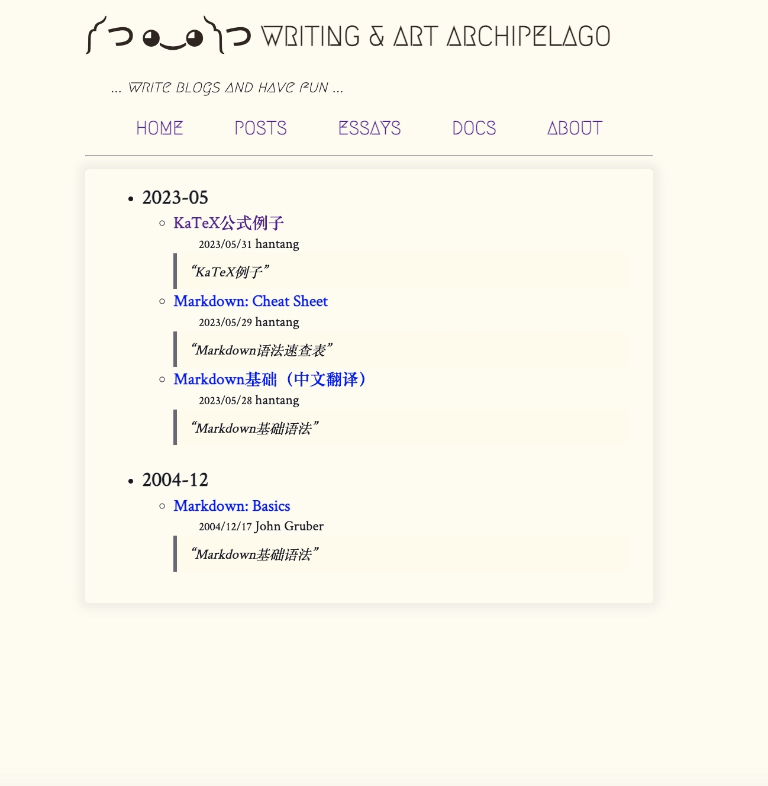
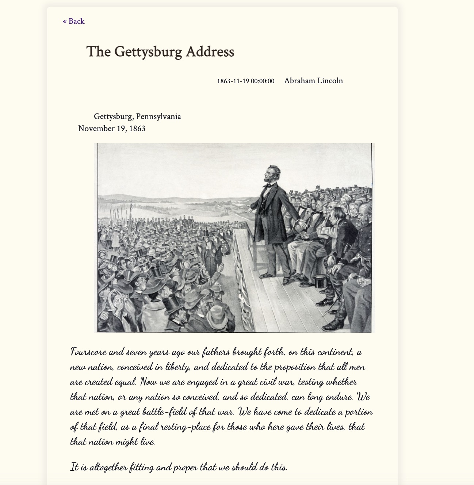

# weblog

A python static blog generator.

## Overview

`Weblog` is a simple static blog generator built with python.

Inspired by
* [Hugo](https://github.com/gohugoio/hugo/),
* [Maverick](https://github.com/AlanDecode/Maverick)
* [pelican](https://github.com/getpelican/pelican)
* and [mkdocs](https://github.com/mkdocs/mkdocs) etc.

mainly techs:

* markdown parser: [mistune](https://github.com/lepture/mistune)
* math support: [ketax](https://github.com/KaTeX/KaTeX)
* date and time parsing: [pendulum](https://pendulum.eustace.io/)
* toml/yaml
* ...

## Demo

Here is: [https://hantang.github.io/weblog/](https://hantang.github.io/weblog/)

Snapshots:

* 
* 
* 
* 

## Usage

A example is here:

```bash
# install weblog
https://github.com/hantang/weblog.git
cd weblog
pip install .

# then cd <somewhere>
# init project (default site-name is blog-site)
python -m weblog init [--path site-name] [--query]

# build the site
cd <site-name>
python -m weblog build

# run local server
python -m http.server -d deploy
# then open `http://localhost:8000`

# clean deploy
python -m weblog clean
```

## Build Packages

```bash
# ref: https://packaging.python.org/en/latest/tutorials/packaging-projects/
# pypython.toml
# install dependencies
python3 -m pip install --upgrade pip
python3 -m pip install --upgrade build

# build to wheel
python3 -m build

# install
pip install dist/weblog-0.0.2-py3-none-any.whl
```

## Themes

### theme-vanilla

* style: mainly from [riggraz/no-style-please](https://github.com/riggraz/no-style-please/)
* fonts: `Megrim` - [John MacFarlane](https://www.johnmacfarlane.net/)
* code highlight: [numist/highlight-css](https://github.com/numist/highlight-css/)
* favicon: created by [favicon](https://favicon.io/) with symbol emptyset `∅`.
